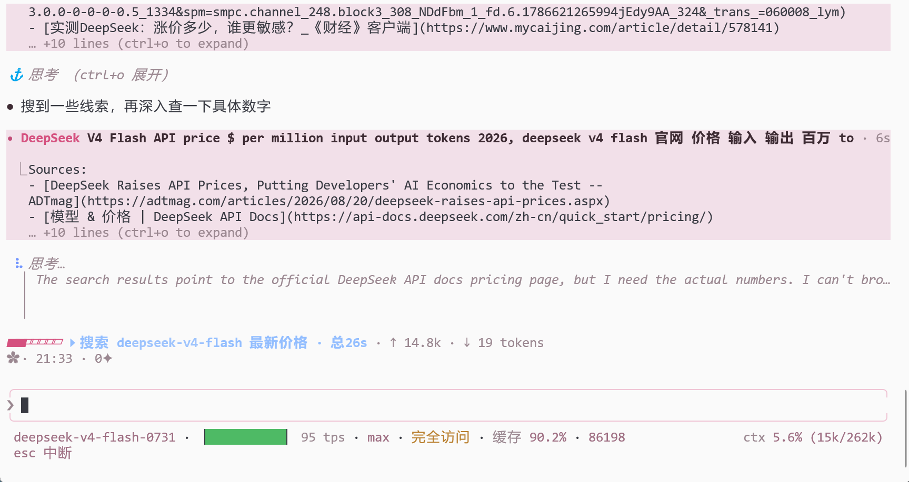
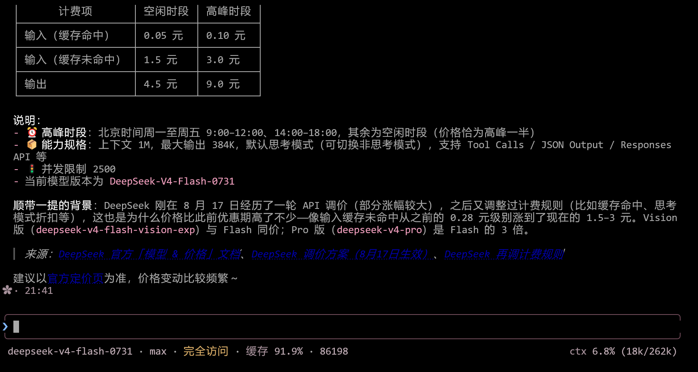
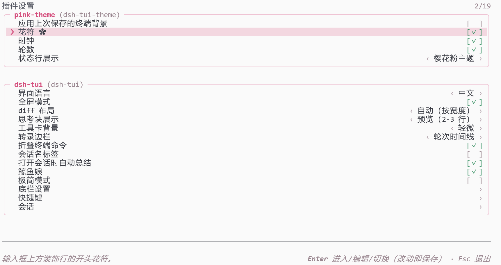

# dsh-tui-theme 🌸

[dsh-TUI](https://github.com/ccch1mneyyy/dsh-TUI) 的樱花粉主题插件。一个包带来四种个性化，全部走官方接缝：

| 个性化 | 接缝 | 说明 |
| --- | --- | --- |
| **三套粉色主题** | 主题运行时（dsh-TUI ≥ 0.10.0）/ 静态资产（旧宿主） | `pink-night` 夜樱 / `pink-day` 昼樱 / `pink-ansi` 樱·ANSI；新宿主优先即时注册，服务晚到时短暂回退并清理本次文件，旧宿主使用 `~/.dsh-tui/themes/` |
| **缓存背景跟随** | 设置 + 本地缓存 | 可选地应用已有 `theme-follow.json` 的昼樱/夜樱结果；不直接读取终端输入或发送 OSC 查询 |
| **花符状态行** | `tuiStatus` | 输入框上方一行小装饰：✿ · 时钟 · 实时轮数（默认仅粉主题下显示） |
| **设置面板** | `tuiSettingsSections` | `/settings` 里一个可编辑区块，改完即时生效 |

**明确不做的事**：不注册快捷键、不注册/修改任何命令、不拦截输入、不追加会话事件、不注入 system prompt。卸载即无痕（可选删除主题文件）。

## 主题预览

| 主题 | 基底 | 风格 |
| --- | --- | --- |
| `pink-night` 夜樱 | dark | 暗梅底、玫瑰粉强调，95 键全覆盖 |
| `pink-day` 昼樱 | light | 象牙粉底、墨梅正文、柔和玫瑰强调（已通过宿主浅色身份判定） |
| `pink-ansi` 樱·ANSI | dark-ansi | 16 色 ANSI 回退，品牌色映射到 magenta 系 |

三套均通过 dsh-TUI 官方校验器（零警告、全键覆盖）与 WCAG 对比度检查（正文 ≥ 11:1）。

## 截图

主题主界面截图实测于 dsh-tui 0.9.2；0.9.3 的 `/settings` 卡片界面见下图：

| 昼樱 `pink-day` | 夜樱 `pink-night` |
| :---: | :---: |
|  |  |

`/settings` 里的 pink-theme 区块（终端背景 / 花符 / 时钟 / 轮数 / 状态行展示，保存即时生效）：



> 图中 ❯ 提示符与链接是宿主硬编码的，见下文[宿主限制](#受宿主限制目前无法定制的部分)。

## 缓存背景跟随

`dsh-TUI` 没有向插件公开安全的终端查询接缝。为了不与宿主的 stdin/raw-mode 生命周期竞争，插件不会直接发送 OSC 11，也不会读取终端输入。

“应用上次保存的终端背景”开启后：

- 启动时读取 `~/.dsh-tui/theme-follow.json` 中已有的 `light` 结果，亮 → `pink-day`，暗 → `pink-night`，并将选择写入 `~/.dsh-tui/theme.json`；
- 不存在缓存时完全保留当前 `/theme` 选择；插件不会自行创建或刷新缓存；
- 默认关闭。该缓存可由之前的兼容版本留下；未来 dsh-TUI 提供宿主拥有的查询接缝后，插件才会安全地恢复刷新能力；
- 开启后该缓存会在启动时覆盖 `/theme` 的持久选择；关闭即可恢复手动选择；
- `DSH_TUI_THEME` 环境变量仍然最优先（宿主行为，插件不覆盖环境变量）。

## 安装

```sh
# 方式一：从 npm（已发布）
dsh plugin --profile dsh-tui add -w dsh-tui-theme@latest

# 方式二：本地 tarball（开发/自用；不要直接安装源码目录）
cd /path/to/dsh-tui-theme
npm run build
npm pack
dsh plugin --profile dsh-tui add -w ./dsh-tui-theme-<版本号>.tgz
```

不要以本地源码目录作为依赖安装：其开发 `node_modules` 可能与 dsh-TUI 宿主解析出不同的 Cordis/DSH framework instance，造成插件无法注册服务。

### 升级

```sh
# npm 已发布版本：请求最新版本并刷新 profile 依赖
dsh plugin --profile dsh-tui add -w dsh-tui-theme@latest
```

在 dsh-TUI ≥ 0.10.0 中，三套主题通过 `ctx.tuiThemes` 运行时注册：调色板随插件即时生效，正常挂载时不写入用户目录，主题选择器显示中文 `displayName`。若服务晚到，插件会先同步回退到静态路径，并在确认运行时服务后删除本次写入且仍未被改写的文件。旧宿主使用静态文件路径：插件只在主题文件缺失时复制，绝不覆盖你编辑过的 `~/.dsh-tui/themes/pink-*.json`。唯一的例外是已损坏的目标文件（无法解析为 JSON，例如安装中途中断留下的残文件）：插件会把它改名为 `<文件名>.corrupt-<时间戳>` 保留现场，再重新安装内置副本，并记录一条警告。

从旧宿主升级后，若希望改用运行时托管，请先备份并删除 `~/.dsh-tui/themes/pink-{night,day,ansi}.json`；插件不会自动删除用户文件。

旧宿主重启 dsh-TUI 后插件会把三套主题复制进 `~/.dsh-tui/themes/`（**仅缺失时复制，绝不覆盖你已有的同名文件**）；0.10.0 及更新宿主则直接使用运行时注册，然后：

```sh
# 在 dsh-TUI 里
/theme              # 选择器：夜樱 / 昼樱 / 樱·ANSI
/theme pink-night   # 或直接切换（开启跟随后由插件接管）
```

## 配置

配置有三层，优先级：`/settings` 用户层 > `cordis.yml` 配置层 > 内置默认值。

`/settings` 里找到 **pink-theme** 区块即可编辑：

| 字段 | 默认 | 说明 |
| --- | --- | --- |
| `followSystem` | `false` | 启动时应用上次保存的终端背景结果（昼樱 ↔ 夜樱）；插件不刷新缓存 |
| `showGlyph` | `true` | 花符：开 = ✿ 开头，关 = 不显示 |
| `showClock` | `true` | 显示 HH:MM 时钟 |
| `showTurns` | `true` | 显示当前会话轮数（`N✦`，自本次启动起计） |
| `statusScope` | `pink-only` | 状态行展示：`pink-only` 仅樱花粉主题 / `all-themes` 所有主题 |

三项装饰全关时状态行整体消失。另有仅 profile 层的开关（`cordis.patch.yml`，不出现在 /settings）：`autoInstallThemes`、`statusEnabled`。

## 受宿主限制、目前无法定制的部分

以下元素的颜色/形态由 dsh-TUI 宿主**硬编码**，不读取任何主题键，主题 JSON 与插件接缝都覆盖不到（dsh-TUI 0.9.3 实测）：

| 元素 | 现状 | 位置（宿主源码） |
| --- | --- | --- |
| 输入框 ❯ 提示符 | 默认态无颜色参数（终端默认前景色，模型工作时变暗）；最高推理档充能动画用**写死的蓝色 ramp**（深色端 `#82B9FF` / 浅色端 `#1E5FEB`） | `EffortChargeGlyph.tsx`、`trajectory/effortIgnition.ts` |
| 底栏上下文进度条分段色 | system / prompt / assistant / thinking / tools 五段为**写死的藏青→品牌蓝系**（`#22305F`→`#5A7CFF`），永远不随主题变化 | `screens/StatusMetrics.ts` |
| 进度条空余段配色 | 宿主按 `themeName === 'light'` **字符串比较**取浅色配色——自定义浅色主题（如 pink-day）不等于 `'light'`，会拿到深色空余段，在浅色终端上偏深 | `screens/StatusLine.tsx` |
| 状态行文字颜色 | 插件状态行（tuiStatus）由宿主统一以**无色 + 终端 dim** 渲染，插件无法指定颜色（✿ 行因此继承终端默认前景色） | `screens/Chat.tsx` |
| 输入框块状光标 | 宿主挂载期间隐藏终端原生光标（`?25l`），输入框光标由应用以**反色字符**自绘（`<Text inverse>`），颜色即主题 text/background 的反色——OSC 12 光标色只能染到不可见的原生光标，插件无法给输入光标上色（辅助功能模式 `CLAUDE_CODE_ACCESSIBILITY=1` 下原生光标才可见） | `ink/components/App.tsx`、`components/PromptInput.tsx` |
| 正文链接 | OSC 8 超链接默认**写死的 ANSI 蓝**（`chalk.blue`）；注释说明 wrap-ansi 无法跨 OSC 8 保留主题 RGB 色，故链接色不读主题键 | `cc/hyperlink.ts` |
| 主界面组件与布局 | 顶栏像素鲸鱼、工具卡、输入框等宿主组件不可被插件替换或改布局——平台规则（内建优先，无组件替换接缝）；主题能碰的只有颜色层 | 宿主架构约定 |

这些都需要上游 dsh-TUI 修改（例如：把充能色/进度条分段色接入主题键、空余段判断改用 `isLightThemeActive()`、给输入光标增加主题键）。上游修复前，任何社区主题包都受同样约束。

## 卸载

```sh
# 先在 dsh-TUI 内切换到非 pink-* 主题，例如：
/theme auto

# 再移除插件和可选的本地主题资产
dsh plugin --profile dsh-tui remove -w dsh-tui-theme
rm ~/.dsh-tui/themes/pink-{night,day,ansi}.json
rm ~/.dsh-tui/theme-follow.json
```

## 开发

```sh
npm install
npm run build
npm run verify
npm run verify:package
DSH_TUI_ADAPTER_DIR=/path/to/dsh-TUI/lib/types/dsh-adapter \
DSH_TUI_SOURCE_ROOT=/path/to/dsh-TUI-source \
npm run verify:host
```

`verify:host` 默认使用开发依赖中的 dsh-TUI（当前为 0.10.0-beta.4）进行零配置验证；需要验证旧版或发布基线时，再显式指向同一版本的宿主 adapter 与源码。需要锁定版本时，额外设置 `DSH_TUI_EXPECTED_VERSION`。

主题调色板改起来最直接：编辑 `themes/*.json` 后重新 `npm run verify`，再删掉 `~/.dsh-tui/themes/` 下对应文件让插件重装。

## 兼容性

- **dsh-TUI 版本下限：0.8.8**（状态行与设置面板；0.9.3 实测）。0.10.0 及更新版本使用运行时主题注册；更旧的宿主缺 `dsh-tui-extensions` 扩展面时，插件自动降级为“仅安装三套主题”，不报错。
- Node `^22.19 || >=24`，纯 ESM，MIT。
