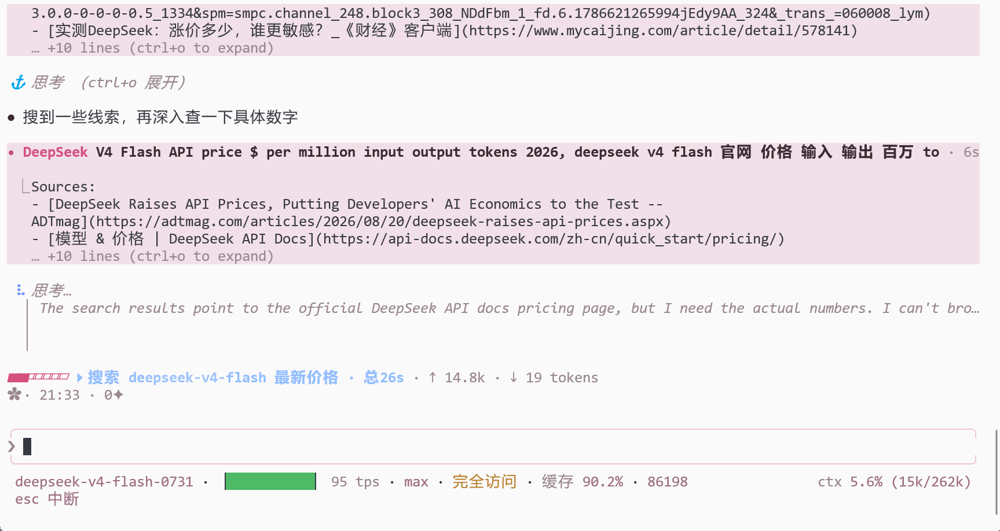
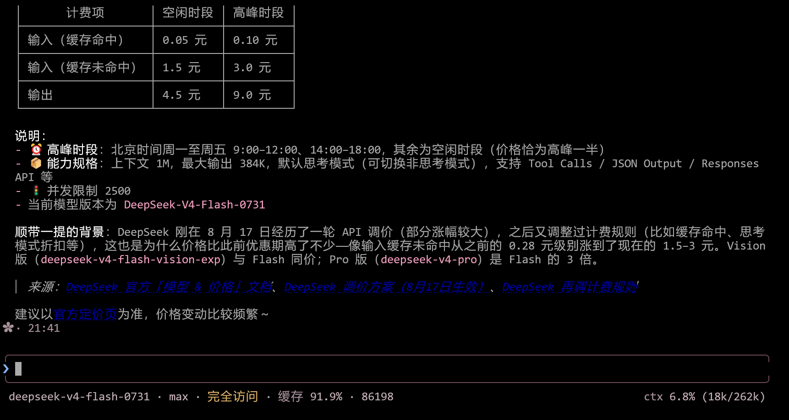
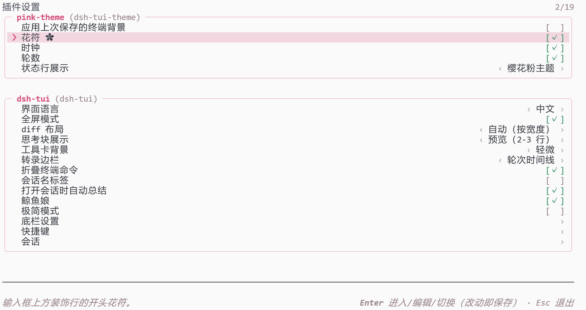

# dsh-tui-theme 🌸

**简体中文** | [English](README_EN.md)

[dsh-TUI](https://github.com/ccch1mneyyy/dsh-TUI) 的樱花粉主题插件：一个包带来三套粉主题、花符状态行与 `/settings` 区块，全部走官方接缝，不注册快捷键或命令，卸载即无痕。

## 能力一览

| 能力 | 接缝 | 说明 |
| --- | --- | --- |
| **三套粉色主题** | 主题运行时（dsh-TUI ≥ 0.10.0）/ 静态资产（旧宿主） | `pink-night` 夜樱 / `pink-day` 昼樱 / `pink-ansi` 樱·ANSI |
| **缓存背景跟随** | 设置 + 本地缓存 | 可选地复用已保存的 `theme-follow.json` 结果；不读终端输入、不发 OSC 查询 |
| **花符状态行** | `tuiStatus` | 输入框上方一行装饰：✿ · 时钟 · 实时轮数（默认仅粉主题下显示） |
| **设置面板** | `tuiSettingsSections` | `/settings` 里一个可编辑区块（背景跟随 / 状态行两组子页），保存即时生效 |
| **屏幕提示** | `tuiToast`（≥ 0.10.0） | 背景跟随结果、主题文件自愈、旧文件遮蔽提醒；旧宿主静默降级 |
| **旧文件清理** | `tuiDialogs`（≥ 0.9.3） | 检测到遮蔽旧主题文件时提供一次性宿主确认对话框，只清理逐字节相同的副本 |

**明确不做的事**：不注册快捷键、不注册或修改命令、不拦截输入、不追加会话事件、不注入 system prompt。`tuiDialogs` 是宿主托管的中性确认面板——宿主自渲染、宿主拥有键盘，插件只提交请求，因此不算输入拦截。

## 快速开始

```sh
# 安装（npm 已发布版本）
dsh plugin --profile dsh-tui add -w dsh-tui-theme@latest
```

```sh
# 在 dsh-TUI 里切换主题
/theme              # 选择器：夜樱 / 昼樱 / 樱·ANSI
/theme pink-night   # 或直接切换（开启背景跟随后由插件接管）
```

本地 tarball 安装（开发 / 自用）：

```sh
cd /path/to/dsh-tui-theme
npm run build
npm pack
dsh plugin --profile dsh-tui add -w ./dsh-tui-theme-<版本号>.tgz
```

> 不要以本地源码目录作为依赖安装：其开发 `node_modules` 可能与 dsh-TUI 宿主解析出不同的 Cordis/DSH framework instance，插件会无法注册服务。

升级同样是重跑一次 `dsh plugin --profile dsh-tui add -w dsh-tui-theme@latest`。

## 主题

| 主题 | 基底 | 风格 |
| --- | --- | --- |
| `pink-night` 夜樱 | dark | 暗梅底、玫瑰粉强调；全键覆盖宿主 Theme（0.10.x 为 73 语义键，旧键名经宿主别名映射兼容） |
| `pink-day` 昼樱 | light | 象牙粉底、墨梅正文、柔和玫瑰强调（通过宿主浅色身份判定） |
| `pink-ansi` 樱·ANSI | dark-ansi | 16 色 ANSI 回退，品牌色映射到 magenta 系 |

三套均通过 dsh-TUI 官方校验器（零警告、全键覆盖）与 WCAG 对比度检查（正文 ≥ 11:1）。

### 截图

主题主界面实测于 dsh-tui 0.9.2，`/settings` 卡片界面来自 0.9.3：

| 昼樱 `pink-day` | 夜樱 `pink-night` |
| :---: | :---: |
|  |  |

`/settings` 里的 pink-theme 区块（终端背景 / 花符 / 时钟 / 轮数 / 状态行展示，保存即时生效）：



> 图中 ❯ 提示符与链接是宿主硬编码的，见[宿主硬编码的部分](#宿主硬编码主题覆盖不到的部分)。

## 配置

优先级：`/settings` 用户层 > `cordis.yml` 配置层 > 内置默认值。在 `/settings` 里找到 **pink-theme** 区块（分「背景跟随」「状态行」两组子页）：

| 字段 | 默认 | 说明 |
| --- | --- | --- |
| `followSystem` | `false` | 启动时应用上次保存的终端背景结果（昼樱 ↔ 夜樱）；插件不刷新缓存。开启时直接显示缓存状态，如 `on（缓存: light · 2026-09-12）` 或 `on（无缓存，启动时不动）` |
| `showGlyph` | `true` | 花符开关：开 = 以花符开头，关 = 不显示 |
| `statusGlyph` | `✿` | 花符字符：1–2 个显示单元、不接受控制字符，留空恢复默认 |
| `showClock` | `true` | 显示 HH:MM 时钟 |
| `showTurns` | `true` | 显示当前会话轮数（`N✦`，自本次启动起计） |
| `statusSeparator` | `·` | 各段之间的分隔符，校验规则同花符字符 |
| `statusScope` | `pink-only` | 状态行展示：`pink-only` 仅樱花粉主题 / `all-themes` 所有主题 |

三项装饰（花符 / 时钟 / 轮数）全关时状态行整体消失。另有仅 profile 层的开关（写在 `cordis.patch.yml`，不出现在 `/settings`）：`autoInstallThemes`、`statusEnabled`。

> 上表就是本插件的可编辑面：卡片字段与 `src/liveConfig.ts` 的 `LIVE_CONFIG_KEYS` 逐键相等，由 `npm run verify` 双向断言。

## 缓存背景跟随

dsh-TUI 没有向插件公开安全的终端查询接缝。为了不与宿主的 stdin/raw-mode 生命周期竞争，插件不发送 OSC 11，也不读取终端输入——只复用你既有的缓存（默认关闭）：

- 开启后，启动时读取 `~/.dsh-tui/theme-follow.json` 中已有的 `light` 结果：亮 → `pink-day`，暗 → `pink-night`，并写入 `~/.dsh-tui/theme.json`；
- 没有缓存时完全保留当前 `/theme` 选择；插件不会自行创建或刷新缓存；
- 该缓存可能由早期兼容版本留下；等 dsh-TUI 提供宿主拥有的查询接缝后，插件才会恢复刷新能力；
- 开启期间，缓存会在启动时覆盖 `/theme` 的持久选择；关闭即恢复手动选择；
- `DSH_TUI_THEME` 环境变量始终最优先（宿主行为，插件不覆盖）。

在 dsh-TUI ≥ 0.10.0 上，跟随结果以 toast 呈现：真正改写了 `theme.json` 时提示「已按保存的终端背景改用 …，/reload 即时生效」（当前画面仍是旧主题，`/reload` 或重启后生效）；在 `/settings` 里手动开启但无缓存时如实提示。启动基线未变化时保持安静，避免每次开机重复打扰。

## 屏幕提示（toast）

插件日志对 TUI 用户不可见，因此少数值得知道的事件走宿主 toast（≥ 0.10.0 的 `tuiToast` 接缝，纯输出、不拦截任何输入；旧宿主没有该接缝，自动退回纯日志）：

| 事件 | 提示 |
| --- | --- |
| 背景跟随改写了主题偏好 | ✿ 已按保存的终端背景改用 …，/reload 即时生效 |
| 手动开启跟随且缓存与当前一致 | ✿ 已按保存的终端背景保持 … |
| 手动开启跟随但无缓存 | ✿ 没有保存的终端背景缓存，保持当前主题（警告色） |
| 主题文件损坏被自动修复 | ✿ 已修复损坏的主题文件：…（警告色） |
| 旧版遗留的同名主题文件与内置版本完全相同 | ✿ … 与插件内置相同，删除后配色将随插件自动更新 |

最后一条只针对与内置副本逐字节相同的文件——你手动调过色的文件永远不会被提及或删除。遮蔽场景在 dsh-TUI ≥ 0.9.3 还会弹一次性确认对话框：确认后按同样的逐字节校验清理副本并以 toast 反馈，拒绝或忽略则一切维持现状。

## 主题文件：安装、自愈与清理

- **运行时宿主（≥ 0.10.0）**：三套主题经 `ctx.tuiThemes` 即时注册，调色板随插件生效，正常挂载不写用户目录；若服务晚到，插件先同步回退到静态路径，确认运行时服务后删除本次写入且仍未被改写的文件。
- **旧宿主**：只在 `~/.dsh-tui/themes/` 缺少目标文件时复制，绝不覆盖你编辑过的 `pink-*.json`。
- **损坏文件是唯一例外**：无法解析为 JSON 的残文件（例如安装中途中断）会被改名为 `<文件名>.corrupt-<时间戳>` 保留现场，再重新安装内置副本，并记录一条警告、弹一条 toast。
- **从旧宿主升级**：想改用运行时托管，请先备份再删除 `~/.dsh-tui/themes/pink-{night,day,ansi}.json`；插件不会自动删除用户文件。与内置副本完全相同的遗留文件会收到一次性提醒和确认对话框。

## 宿主硬编码、主题覆盖不到的部分

以下元素的颜色/形态由 dsh-TUI 宿主硬编码，不读任何主题键，主题 JSON 与插件接缝都无法覆盖（0.9.3 首测，0.11.0 逐条复核、0.11.2 复查，其中「顶栏文字色」一项的表述已更正）。这些都需要上游 dsh-TUI 修改（例如把充能色/进度条分段色接入主题键、空余段判断改用 `isLightThemeActive()`、给输入光标增加主题键）；上游修复前，任何社区主题包都受同样约束。

<details>
<summary>展开完整清单（10 项，含宿主源码位置）</summary>

| 元素 | 现状 | 位置（宿主源码） |
| --- | --- | --- |
| 输入框 ❯ 提示符 | 默认态无颜色参数（终端默认前景色，模型工作时变暗）；最高推理档充能动画用写死的蓝色 ramp（深 `#82B9FF` / 浅 `#1E5FEB`） | `EffortChargeGlyph.tsx`、`trajectory/effortIgnition.ts` |
| 底栏上下文进度条分段色 | system / prompt / assistant / thinking / tools 五段为写死的藏青→品牌蓝（`#22305F`→`#5A7CFF`），永不随主题变化 | `screens/StatusMetrics.ts` |
| 进度条空余段配色 | 宿主按 `themeName === 'light'` 字符串比较取浅色配色——自定义浅色主题（如 pink-day）不等于 `'light'`，会拿到偏深的空余段 | `screens/StatusLine.tsx` |
| 状态行文字颜色 | 旧路径标量状态行由宿主统一以无色 + 终端 dim 渲染；≥ 0.10.1 插件已改用 `tuiStatus.registerView` 富状态视图按主题配色，旧宿主自动回退标量路径 | `screens/Chat.tsx`、`dsh-adapter/status.ts` |
| 输入框块状光标 | 宿主隐藏终端原生光标，输入框光标由应用以反色字符自绘，颜色即主题 text/background 的反色；OSC 12 只能染到不可见的原生光标（辅助功能模式 `CLAUDE_CODE_ACCESSIBILITY=1` 下原生光标才可见） | `ink/components/App.tsx`、`components/PromptInput.tsx` |
| 正文链接 | OSC 8 超链接默认写死的 ANSI 蓝（`chalk.blue`）；注释说明 wrap-ansi 无法跨 OSC 8 保留主题 RGB 色，故链接色不读主题键 | `cc/hyperlink.ts` |
| 顶栏像素鲸鱼颜色 | 调色板写死且模块加载时预渲染，任何主题都无法改变鲸鱼配色——0.9.3 为四色（描边/身体/腹部/嘴），0.10.x 起为六色（另有心形与睡眠 Z 两个状态色） | `components/Whale.tsx` |
| 顶栏文字色 | ✦ 字标与欢迎语跟主题（`claude`，0.10.1 起 `accent`）；字标扫过时的**高光也跟主题**——`LogoV2` 把 `theme.accentShimmer`（0.10.1 起的键名，旧名 `claudeShimmer`）当高光色传给 `sweep()`，本插件三主题均已设值（可见时机仅开场与 `/deepseek` 重播的扫过瞬间）；`DEEPSEEK`/`HARNESS` 两个像素词与欢迎语的扫过高光仍写死为常量 `FLASH`，`HARNESS` 的渐变结尾段是固定常量 `PALE`，其余主色/渐变结尾色跟 `claude`/`claudeBlue_FOR_SYSTEM_SPINNER`（0.10.1 起 `accent`/`activity`）。另：宿主 `parseRGB` 只认 `rgb(r,g,b)`，hex/ansi 值静默回退固定品牌蓝（pink-ansi 因此顶栏仍为蓝色） | `components/LogoV2.tsx`、`components/bigfont.ts`、`components/shimmer.ts`、`components/Spinner/spinnerUtils.ts` |
| 思考消息折叠头脉冲字 | 思考仍在流式输出时，折叠头行首的 spinner 字形在常量 `BRAND`→`ICE` 之间做正弦脉冲（minimal 模式直接去色）；同一行的标题文字才跟主题（hover 取 `text`，否则 dim） | `components/messages/AssistantThinkingMessage.tsx`、`components/shimmer.ts` |
| 主界面组件与布局 | 顶栏鲸鱼、工具卡、输入框等宿主组件不可被插件替换或改布局——平台规则（内建优先，无组件替换接缝），主题能碰的只有颜色层 | 宿主架构约定 |

</details>

## 卸载

```sh
# 先在 dsh-TUI 内切换到非 pink-* 主题
/theme auto

# 再移除插件和可选的本地主题资产
dsh plugin --profile dsh-tui remove -w dsh-tui-theme
rm ~/.dsh-tui/themes/pink-{night,day,ansi}.json
rm ~/.dsh-tui/theme-follow.json
```

## 兼容性

- **dsh-TUI 下限 0.8.8**（状态行与设置面板，0.9.3 实测）。0.10.0 及更新版本使用运行时主题注册；0.10.1 起状态行走富状态视图按主题配色（更旧宿主自动回退无色标量行）；缺 `dsh-tui-extensions` 扩展面的宿主自动降级为「仅安装三套主题」，不报错。
- **`dsh-settings` 两代都支持**：≤ 0.1.6（dsh-TUI 0.9.x/0.10.x）走插件注册命名空间 + `scope.watch`；≥ 0.1.7（dsh-TUI 0.11+）走 Config volatile 字段投影 + `loader/volatile-update` 重读。判定按能力探测，不解析版本号；两条路径的失败都写日志而不是静默。
- **dsh 运行时 `0.2.0-rc.1` 起有启动期 peer 校验**：宿主读 bundle 的 `peerDependencies`，把 `@deepseek-ai/dsh` / `@deepseek-ai/dsh-*` 段与运行时版本比对，不匹配就跳过整个 bundle（stderr 提示 `skipping profile bundle`）。本插件的 peer 段覆盖 `0.1.0-rc.6`–`0.1.x` 与 `0.2.0-rc.1`–`0.2.x`（自 v0.7.3 起，新世代写作 `^0.2.0-rc.1`），因此 0.2 宿主正常加载。宿主校验固定用 `includePrerelease` 语义，故 0.2 线的预发布档同样放行；而 npm 默认预发布语义更窄，将来出现的 `0.2.1-rc.x` 之类档位在 npm 侧会报 unmet peer（框架包由 dsh CLI 提供、profile 不装 `@deepseek-ai/*`，实际不受影响）。
- Node `^22.19 || >=24`，纯 ESM，MIT。

## 开发

```sh
npm install --include=dev   # 本仓不提交 lockfile，务必带 --include=dev
npm run build
npm run verify
npm run verify:package
```

安装前提、验证脚本参数（`verify:settings` / `verify:host`）、CI 门禁与调色板改动流程见 [docs/development.md](docs/development.md)。
